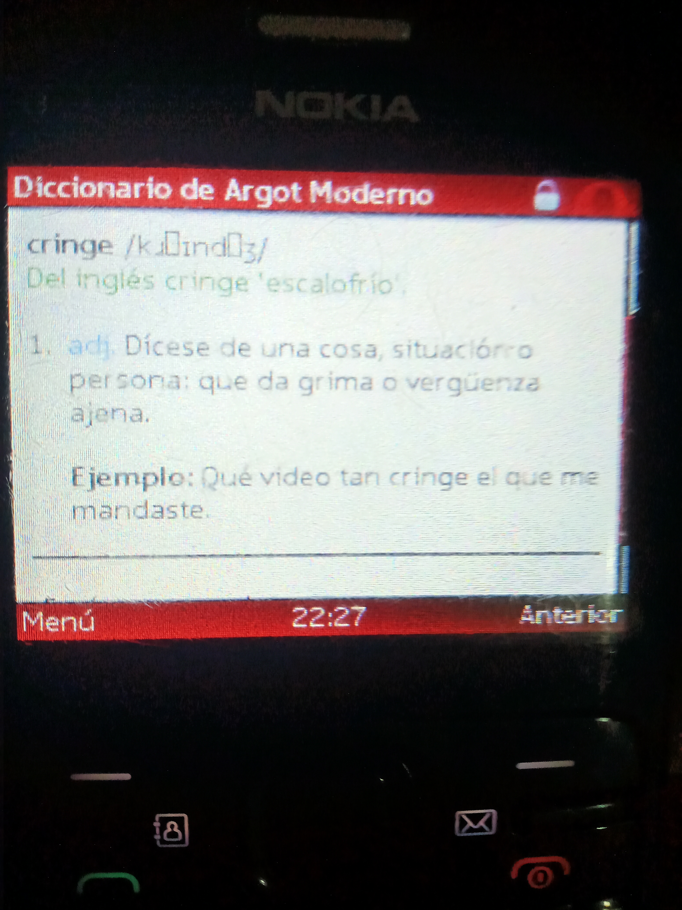

# El Diccionario de Argot Moderno

¿Te has preguntado qué diablos significan palabras como "random" o "cringe"? ¿Quieres entender a la nueva generación?
¡Pues el Diccionario de Argot Moderno está aquí para ti! Su [interfaz web minimalista](https://dam-cycq.onrender.com) te permite
consultar lo que necesites, ¡incluso en un Nokia de hace 13 años!

